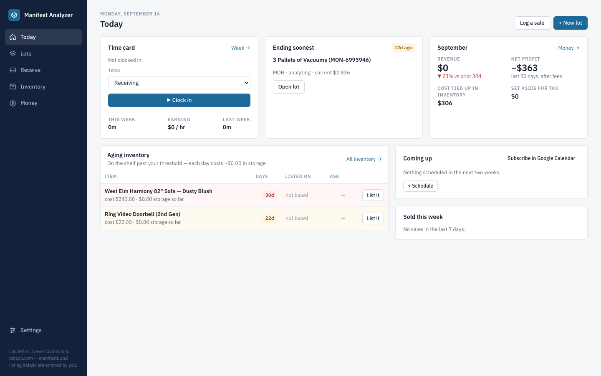

# Manifest Analyzer

**Manifest in, walk-away max bid out — then receive, sell, and track the lot to the end.**

A local-first app for buying B-Stock liquidation lots and running the resale. Feed it a
manifest you downloaded from a listing plus a few manually entered details; it gives you a
valuation, a **walk-away max bid**, and a landed unit price. When you win, it walks the lot
through check-in, salvage, listing on your selling channels, sales, and the money.




---

## The lifecycle

Every lot moves through one thread, and each screen owns one stage:

```
Analyzing → Bid placed → Won → Received → Selling → Closed
  Lots        Lots       Receive   Inventory   Money
```

| Screen | What it does |
| --- | --- |
| **Today** | The daily open: time card (clock in/out), the lot waiting for check-in, this month's money, inventory that's aging on the shelf, what's coming up, what sold. |
| **Lots** | Stage board with column totals; cards show verdict, max bid, landed $/unit; a won lot that isn't checked in turns pink. Table view sorts confirmed lots by landed unit price. Click a card for the full analysis (mapping → context → comps → verdict → outcome). |
| **Receive** | Check a won lot in against its manifest: per line, how many arrived and how many work / are incomplete / have a weak battery / are dead. Working units flow into Inventory with cost basis = landed unit cost. The **salvage plan** pools dead and weak units by product family, suggests cannibalisation, and lists parts with your own value ranges. |
| **Inventory** | Items × selling channels. Each listing carries its ask and the channel's fee rule, so you see **net after fees** per channel. Status is derived (unlisted → listed → sold). Days on shelf and a per-item-day carrying cost drive aging alerts and a one-click price cut. Listing drafts per channel (template, or Claude when a key is configured). |
| **Money** | Scorecards with change vs. the previous period; one chart area with a switcher — revenue vs. goal, net profit, funnel, cycle time, hours, storage; the **time card** (punch clock, week grid, hours by task, profit per hour); storage and other recurring costs that post themselves; predicted vs. actual per lot with labor and cycle time; tax set-aside. |
| **Settings** | Buyer rules, fees & recovery rates, selling channels, the salvage parts book, integrations (Google Calendar feed, Claude drafts, password), CSV exports. |

Installable as a **PWA**: add it to your phone's home screen and it opens full-screen — clock in, check in a pallet one line at a time, mark something sold.

## The compliance boundary

This tool **never** connects to bstock.com or any B-Stock-powered marketplace, and it calls no
marketplace APIs. All listing data enters two ways only:

1. **Manifest files you downloaded yourself** via B-Stock's own download button.
2. **A short manual form** (current bid, end time, freight, premium: about 6 fields).

Selling channels are fee rules and links, nothing more. No scraping, no credential storage, no
automated bidding or posting. The tool outputs numbers; you place the bid and post the listing.

## Quick start

Requires Node ≥ 22.5 (the server runs TypeScript natively).

```sh
git clone https://github.com/GavinXZhang/manifest-analyzer.git
cd manifest-analyzer
npm install
npm run build:web   # builds the React app into web/dist
npm start           # http://127.0.0.1:4317 (loopback only)
```

For frontend work run the API and the Vite dev server side by side:

```sh
npm run dev         # API with restart-on-change, port 4317
npm run dev:web     # Vite on http://localhost:5173, proxies /api to 4317
```

```sh
npm test            # node:test suite (server, calc, store, API e2e)
npm run typecheck   # server + web
npm run build       # web/dist + the Vercel function bundle
```

Try it with the sample manifests in [`fixtures/`](fixtures/).

### Configuration

Data lives in `data/analyzer.db` (SQLite via libSQL) unless a hosted database is configured.

| Variable | Purpose |
| --- | --- |
| `MA_PORT` / `MA_HOST` | Port (default `4317`) and bind address (default loopback) |
| `MA_PASSWORD` | Gate everything behind a password login |
| `TURSO_DATABASE_URL` + `TURSO_AUTH_TOKEN` | Use a hosted Turso database instead of the local file |
| `MA_DB_URL` / `MA_DB_AUTH_TOKEN` / `MA_DB_PATH` | Point at another libSQL URL or file path |
| `ANTHROPIC_API_KEY` | Enables Claude-written listing drafts (templates work without it) |

Schema changes are additive and run on open; one-time data migrations are recorded in the `meta`
table so they run exactly once per database.

## Deploy (Vercel + Turso, from GitHub)

The app is one Vercel serverless function (`api/app.mjs`, built by esbuild) that runs the whole
Express API and serves the built web app, so the password gate covers everything.

1. Create the database:
   ```sh
   turso db create manifest-analyzer
   turso db show manifest-analyzer --url        # → TURSO_DATABASE_URL
   turso db tokens create manifest-analyzer    # → TURSO_AUTH_TOKEN
   ```
2. In Vercel, **import the GitHub repo** (or Project → Settings → Git → Connect for an existing
   project). `vercel.json` already sets the build command (`npm run build`) and the function
   config; leave the framework preset on "Other".
3. Set `TURSO_DATABASE_URL`, `TURSO_AUTH_TOKEN`, and `MA_PASSWORD` for **Production and Preview**
   (never deploy without a password). Add `ANTHROPIC_API_KEY` if you want Claude drafts.
4. Push to `main`. Every push deploys; branches get preview URLs against the same database.

To run locally against the production database, pull the variables with
`vercel env pull .env.production.local --environment=production` and export them before `npm start`.

## The two numbers that are never the same thing

- **Your walk-away number:** a budget fact computed backwards from expected revenue, fees, your
  required profit, freight, and premium. Place one proxy bid at it and stop.
- **The market estimate:** a prediction of where similar lots close, from your own logged
  history. Shown separately with its own label; it never moves your walk-away.

## Conservative by default

- Numbers derived from any estimate render as `~$X *` with the reason listed.
- Grail-heavy lots (>40% of value in ≤3 items) are bid on the grails-excluded valuation.
- Any condition grade outside your acceptable set marks the lot PASS with the constraint named.
- Salvage part values are labeled as your estimates until you confirm them from real sales.

## Project layout

```
src/ingest/      manifest parsing, header detection, column mapping, freight table
src/valuation/   comps (manual), recovery rates, grail detection, calibration, family matching
src/calc/        pure math: bid, pricing, fees, landed cost, aging, salvage, tax (unit-tested)
src/reasoning/   deal rationale + listing draft templates
src/store/       libSQL persistence: lots, stages, receipts, inventory, listings, channels,
                 punches, recurring costs, reports, Today; migrations + seeds
src/ui/          Express API (api.ts + api-lifecycle.ts), auth, ICS feed, server entry
web/             React + Vite app (routes, components, charts), PWA manifest + service worker
api/             Vercel function entry (built, not committed)
fixtures/        sample manifests from three seller layouts
openspec/        spec-driven change history (proposal → design → specs → tasks)
```

## Disclaimer

Not affiliated with or endorsed by B-Stock Solutions. Valuations and salvage values are
estimates; you are responsible for your own bids and listings.
